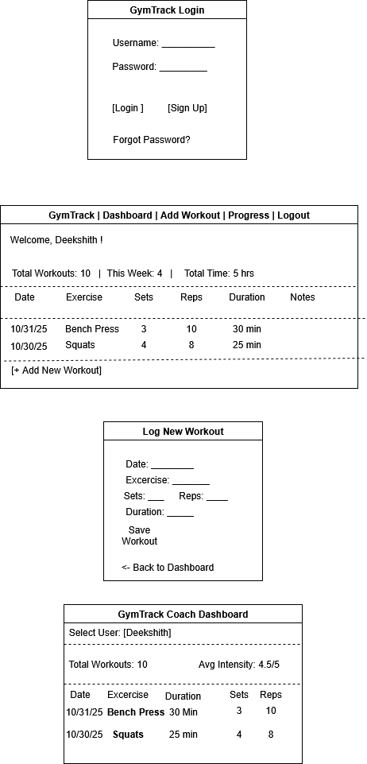

# GymTrack

GymTrack is a simple web-based fitness tracking app that helps users log and review their workouts.  
It allows people to record exercises, track progress, and view improvements over time.  
Coaches can also view client workouts and give personalized feedback.  
The app keeps all data secure with authentication and stores it safely in a PostgreSQL database.  
Built using Django, Docker, and JWT authentication, GymTrack is easy to run and scale.  
It helps users stay organized, motivated, and consistent with their fitness goals.  

---

## Installation

Follow these steps to set up and run the GymTrack application:

bash
# 1️ Clone the repository
git clone https://github.com/Deekshith422003/gymtrack
cd gymtrack

# 2️ Create and activate a virtual environment
python -m venv .venv
.venv\Scripts\activate             # For Windows

# 3️ Build Docker containers
docker-compose build

# 4️ Start the containers
docker-compose up

# 5️ Run database migrations
docker-compose exec web python manage.py makemigrations
docker-compose exec web python manage.py migrate

# 6️ Create a Django superuser for admin access
docker-compose exec web python manage.py createsuperuser

# 7️ Access the app in your browser
http://127.0.0.1:8000

---


## Getting Started

1. Open your browser and visit:  
   **[http://127.0.0.1:8000](http://127.0.0.1:8000)**  

2. Log in using the superuser credentials you created during installation.  

3. To access the Django Admin Panel, go to:  
   **[http://127.0.0.1:8000/admin/](http://127.0.0.1:8000/admin/)**  

4. From the admin panel, you can:
   - Add exercises and workouts  
   - Create and manage user accounts  

5. Use the GymTrack app to:
   - Add new workout entries  
   - View and edit past workouts  
   - Track your fitness progress  

6. To stop the running containers, press **Ctrl + C** in your terminal and run:
   ```bash
   docker-compose down

---

# User Stories

###  **US1 – Log Daily Workouts**
**User Story:**  
As a registered user, I want to log my daily workouts so I can track my fitness progress over time.  

**Acceptance Criteria:**  
- User can create a workout entry with date, exercises, sets, reps, and duration.  
- The workout entry is saved successfully to the database.

---

###  **US2 – View Previous Workouts**
**User Story:**  
As a user, I want to view my previous workouts so I can see my improvement history.  

**Acceptance Criteria:**  
- The system displays a list of workouts that belong only to the logged-in user.  
- Each workout shows details like date, exercises, and performance.

---

###  **US3 – Coach Dashboard**
**User Story:**  
As a coach, I want to view my clients’ workout summaries so I can give personalized feedback.  

**Acceptance Criteria:**  
- The coach role can access all user workout data through a dashboard.  
- Dashboard provides summaries and basic statistics for each client.

---

###  **US4 – Secure Login and Logout**
**User Story:**  
As a user, I want to securely log in and log out so my personal data stays protected.  

**Acceptance Criteria:**  
- JWT authentication ensures only logged-in users can access or modify workout data.  
- Unauthorized users are restricted from accessing private endpoints.

---


# Mis-User Stories

###  **M1 – Unauthorized Data Access**
**Mis-User Story:**  
As an unauthorized user, I want to access another person’s workout data.  

**Mitigation Criteria:**  
- Implement `IsOwner` permission to ensure users can only access their own data.  
- Use JWT authentication to verify and validate user tokens before granting access.

---

###  **M2 – Malicious Data Injection**
**Mis-User Story:**  
As an attacker, I want to send malicious scripts or data through the workout input forms.  

**Mitigation Criteria:**  
- Use Django’s built-in form validation and CSRF protection.  
- Sanitize and validate all input fields before saving to the database.

---

###  **M3 – Brute-Force Login Attempts**
**Mis-User Story:**  
As a malicious user, I want to repeatedly try different passwords to break into other accounts.  

**Mitigation Criteria:**  
- Enforce strong password policies and rate limiting on login attempts.  
- Implement account lockout after multiple failed login attempts.  
- Use logging and monitoring to detect suspicious authentication activity.

---


# Architecture Diagrams (C1 – C3)

The following diagrams illustrate the architectural design of the **GymTrack** web application following the **C4 Model** (Context → Container → Component).

---

###  **C1 – Context Diagram**

**Purpose:**  
Shows how the GymTrack system interacts with external entities such as users, coaches, and supporting services.

**Key Elements:**
- **User:** Logs workouts, views progress, and manages personal fitness data.  
- **Coach:** Monitors client workouts and provides feedback using analytics dashboard.  
- **GymTrack Web App:** Core system that allows tracking, storing, and managing workout data.  
- **PostgreSQL Database:** Stores workout and user information.  
- **JWT Auth Service:** Generates and validates secure authentication tokens.

**Data Flow:**  
User and Coach interact with the GymTrack app → App stores/retrieves data from PostgreSQL → JWT Auth verifies user identity.

 *[See diagram below]*  
[](docs/images/C4%20Milestone%201.drawio.png)

---

###  **C2 – Container Diagram**

**Purpose:**  
Illustrates the major deployable units (containers) that make up the system, and how they communicate.

**Key Containers:**
- **Static UI:** Displays pages built with HTML, CSS (and optionally React).  
- **Backend (Django REST Framework):** Handles all API logic, authentication, and data management.  
- **Database (PostgreSQL):** Stores all workout and user-related data.  
- **JWT Auth Service:** External service for token creation and validation.

**Interactions:**
- User interacts via browser → UI sends REST API requests to Backend.  
- Backend retrieves/stores data in PostgreSQL.  
- Authentication verified via JWT Auth Service.

 *[See diagram below]*  
[](docs/images/C4%20Milestone%201.drawio.png)

---

###  **C3 – Component Diagram**

**Purpose:**  
Shows internal components inside the Django application and how they work together.

**Main Components:**
- **UI Component:** Handles all user interactions via HTML pages and API requests.  
- **Login / Logout:** Manages authentication requests and token revocation.  
- **Workout Summary:** Displays past workout logs.  
- **Add Workout:** Handles creation of new workouts and exercises.  
- **Progress:** Computes statistics and improvement charts.  
- **Backend:** Central logic connecting UI, services, and database.  
- **Authentication Component:** Manages token verification and access control.  
- **Database:** Stores user, exercise, and workout data.  
- **JWT Auth Token:** Verifies users for secure access.

**Data Flow:**  
UI → Backend → Authentication Component → Database → JWT Token validation.

 *[See diagram below]*  
[](docs/images/C4%20Milestone%201.drawio.png)

---


# UI Mockups

The mockup below shows the main interface views — including login, workout dashboard, and progress tracking pages.  
These mockups represent the **core user stories** and help visualize how the app will look and function.

[](docs/images/Mockups.drawio.png)

---

## AI Use Disclosure

### Tools & Usage Summary

- **Documentation & Planning:** I have used (Gemini/ChatGPT) to help structure user stories for the GymTrack application, improve clarity in the milestone documentation, and refine the formatting of the executive summary and project structure.
- **Design & Diagrams:** AI assisted in generating initial versions of the C4 Model diagrams (Context, Container, and Component-level ideas) and mockup descriptions based on my instructions. I defined the architecture and data flows, and AI helped format them according to industry standards.
- **Development (Debugging & Troubleshooting):** All core backend logic, project setup, and system architecture were implemented by me. AI was used only to clarify Django configuration errors, understand command-related issues (Example: Docker, PostgreSQL, migrations), and format README documentation more effectively.
- **Formatting & Editing:** AI assisted with converting draft content into Markdown format for GitHub, organizing installation steps, and improving text readability.

---

###  Nature of Prompts Used

- **For Documentation:**  
  - “Rewrite this user story professionally.”  
  - “Format these installation steps for GitHub README.md file.”  
  - “How to paste the image in github README file.”

- **For Diagrams/Planning:**  
  - “Generate a C4 context diagram description for a Django based Gymetrack application.”  
  - “Help me with structure container interactions between the web client, API, database, and authentication module.”

- **For Debugging:**  
  - “Explain why this Django migration error occurs.”  
  - “Clarify Docker compose setup for PostgreSQL connection.”  
  - “Help improve documentation of JWT authentication steps.”

---

### Ownership Statement

AI tools were used only to refine documentation, format text, assist with diagram organization, and provide guidance for resolving errors.  
 **All final logic, architectural design, coding decisions, and project implementation were completed by me.** The GymTrack system structure and development reflect my personal understanding and work.

---


